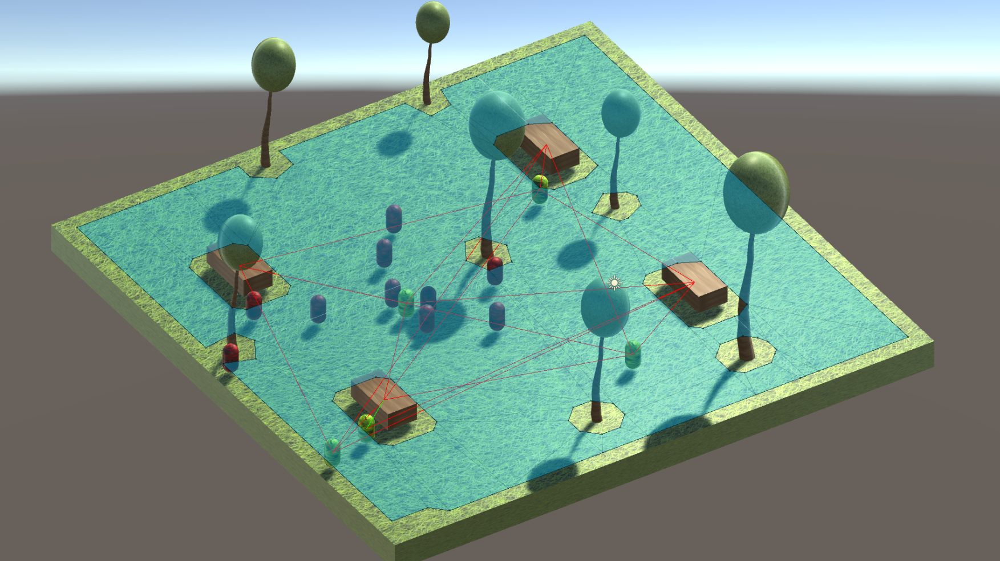

# Unity Artificial Intelligence Project

This project focuses on the implementation of artificial intelligence in the Unity (Unity 2022.3.10f1) environment to create an interactive scenario with runner and elder agents using state machines and smoothing techniques for the movement. In this README, we will explore the key elements of the project without referencing the figures.

## 1. Scenario

The project's scenario has been designed in Unity, allowing the creation of 3D models to represent the surface and obstacles in the environment. Textures and materials have been applied to the objects to enhance their appearance.

In the scenario, NavMesh has been used to define walkable surfaces (floor) and non-walkable surfaces (trees, benches, and the sign).

## 2. Runner Agents

The agents known as "runners" have been implemented through a manager and a "runner" object. Each runner can create a specific number of runners in the scenario and has a state machine to manage its behavior. The state machine consists of two main states:

1. **Wander State**: In this state, the runner patrols the entire scenario, with a starting point and a destination. A minimum and maximum duration for movement between points is assigned, and a random movement speed within the specified range is selected. The destination is also chosen randomly.

2. **Changing Destination State**: When the runner has completed the patrol, a new destination is assigned in this state. After this, the runner will...

After this, the runner returns to the "Wander State."

## 3. Elder Agents

This type of agent, known as "elders," has a slight difference compared to the previous type. If an elder agent detects a nearby bench, it will rest for a few seconds. The elder agent also has a state machine with the following states:

1. **Wander State**: In this state, the elder agent patrols the entire scenario, with a starting point and a destination. A minimum and maximum duration for movement between points are assigned, and a random movement speed within the specified range is selected. The destination is also chosen randomly. If the elder agent detects a bench, and a certain number of seconds have passed since the last "Idle State" or the initial patrol, this state is assigned.

2. **Changing Destination State**: When the elder agent has completed the patrol, a new destination is assigned in this state. After this, the elder agent returns to the "Wander State."

3. **Idle State**: When the elder agent detects a bench, it rests for a few seconds before transitioning to the "Changing Destination State." This state cannot be assigned until a certain number of seconds have passed since bench detection, preventing the elder agent from remaining permanently near a bench.

The runners are represented by red capsules, and the elders are represented by yellow capsules. Additionally, a smoothing technique, Vector3.Lerp, is used for movement.

## 4. Credits

1. Mushin3D. (2015). Seamless tileable Grass texture. DeviantArt.
https://www.deviantart.com/mushin3d/art/Seamless-tileable-Grass-texture-516838656
2. Webtreats. (2010). Wood texture. Flickr.
https://www.flickr.com/photos/webtreatsetc/4727355663/
3. Webtreats. (2011). Glass texture. Flickr.
https://www.flickr.com/photos/webtreatsetc/5796417841/
